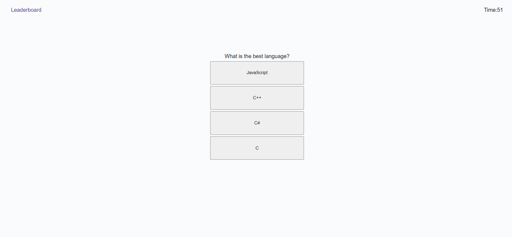

### JS Coding Quiz

## User Story

AS A coding boot camp student
I WANT to take a timed quiz on JavaScript fundamentals that stores high scores
SO THAT I can gauge my progress compared to my peers

## Acceptance Criteria

GIVEN I am taking a code quiz
WHEN I click the start button
THEN a timer starts and I am presented with a question
WHEN I answer a question
THEN I am presented with another question
WHEN I answer a question incorrectly
THEN time is subtracted from the clock
WHEN all questions are answered or the timer reaches 0
THEN the game is over
WHEN the game is over
THEN I can save my initials and score

### Description
This application is a browser based quiz that tests the user over mulitple different questions. The application uses HTML, CSS, and JavaScript to provide the user with a reactive web quiz. The app uitlizes a timer to calculate a score for the user, and the app also has a leaderboard, where the user can enter in their name and their high score is saved. The leaderboard can be cleared, and the multiple pages can me easily navigated.

## Screenshot

## Live Link

[Deployed Application Here](https://rjschroeder.github.io/JSCodingQuiz/)